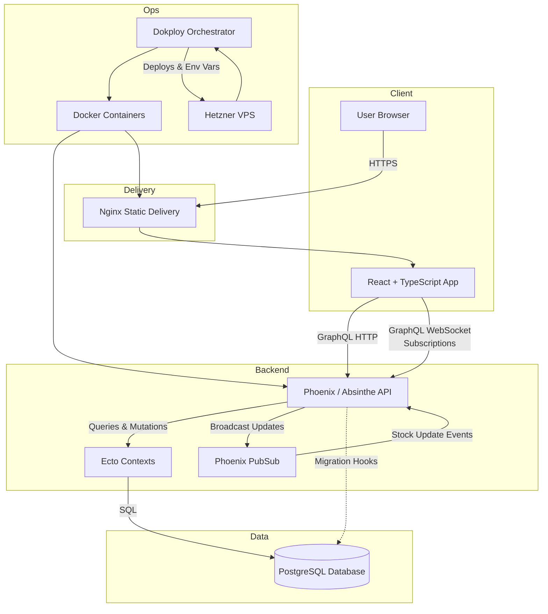

# System Architecture Overview

The diagram below summarizes how the live inventory experience is wired together across the frontend, backend, and infrastructure layers.

## Flow Summary

- The React application is served as static assets by Nginx. Open-source source code lives at [github.com/vektogram/inventory-watch-realtime](https://github.com/vektogram/inventory-watch-realtime).
- Browser clients fetch product data through GraphQL queries and stay synchronized through Absinthe subscriptions over WebSockets.
- The Phoenix backend (source at [github.com/vektogram/elixir_inventory_watcher](https://github.com/vektogram/elixir_inventory_watcher)) persists inventory in PostgreSQL via Ecto and uses Phoenix PubSub to fan out stock-change events.
- Deployments run on a Hetzner VPS managed by Dokploy. Dokploy pulls container images, injects secrets, runs migrations, and restarts services as needed.

This layout keeps the system modular: the frontend, API, and data store are independently deployable while Dokploy coordinates the overall lifecycle on Hetzner."},
